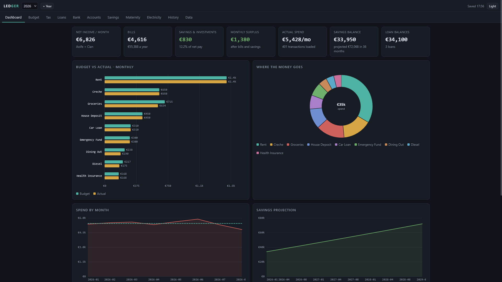
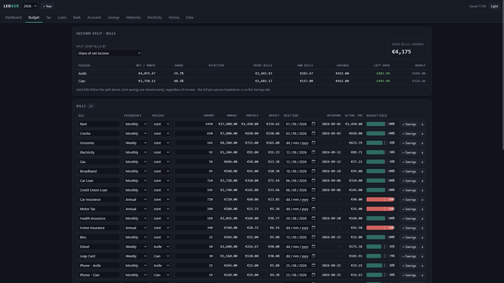
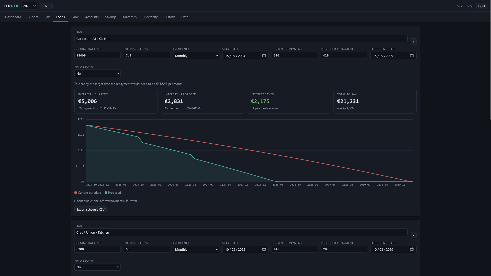
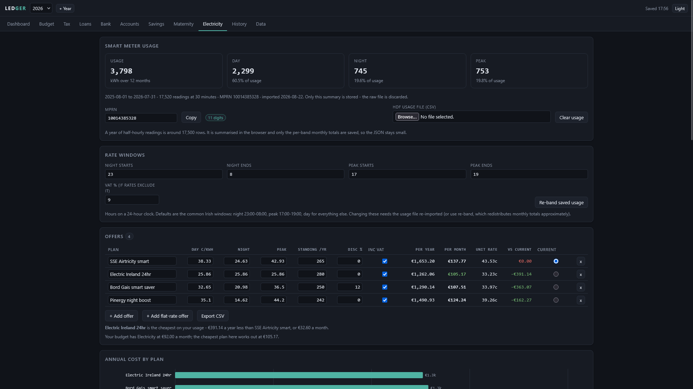
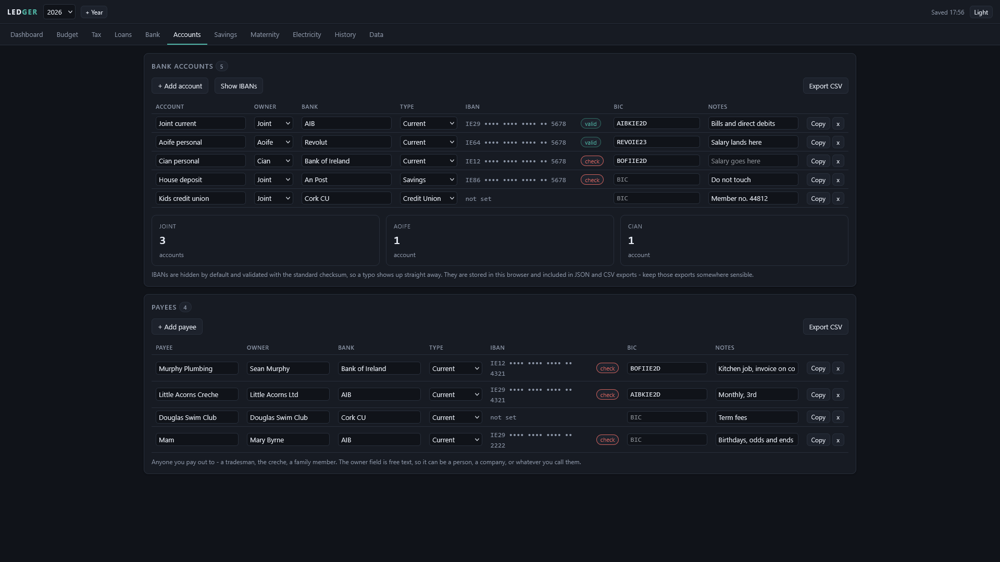
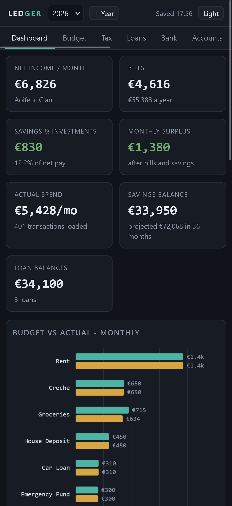
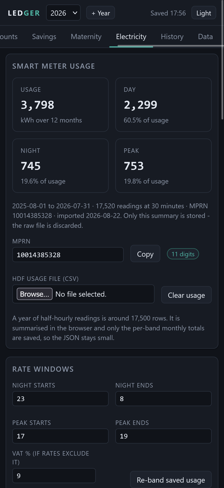
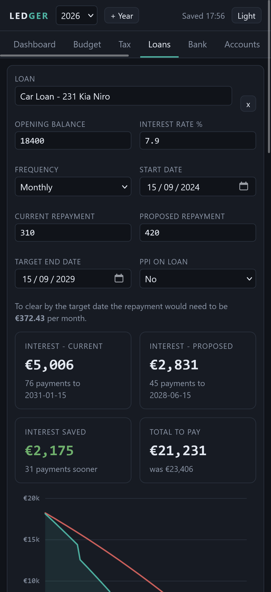

# finance-ledger

A single-file personal finance workbook that runs entirely in your browser.

For years I ran my household finances out of one Excel workbook: bills, an Irish PAYE calculator
I kept re-tuning every Budget, loan amortisation schedules, a bank statement categoriser, savings
projections, a historical bill log. It worked fine but the problem was everything
else around it. Making a change meant opening a laptop. Simulating something temporary, like what
maternity leave does to a few months of cash flow, meant duplicating sheets and hoping I remembered
to delete them. And there was no version I could pull up on my phone standing in a shop.

So I rebuilt it as a web app. One HTML file, no build step, no dependencies, no server. Open it
and it works, offline, on a phone or a laptop, and a "what if" scenario is a tab you fill in and
switch off again rather than a sheet you have to remember to clean up. Your data lives in that
browser's local storage and nowhere else.

## What it does

**Budget** - bills at any frequency from weekly to annual, normalised to annual, monthly and
weekly figures. Savings and investments are tracked in a separate table from bills, so "what do I
spend" and "what do I put away" stay distinct, and anything can be moved between the two with one
click. Assign each line to a person or to the joint pot, and split the joint pot three ways:

- **Share of net income** - pro-rata on what each person takes home
- **Manual percentages** - whatever you decide, scaled to fit if they do not add to 100
- **Even weekly disposable income** - solved so everyone is left with the same amount each week
  after their own bills, their savings and their share of the joint pot

Each person's leftover is worked out after all three, weekly and monthly.

**Tax** - Irish PAYE, USC, PRSI and pension for as many earners as you need. Standard rate band,
credits and USC bands are all editable, with the published figures for the year preloaded. Handles
BIK, AVCs and a bonus taxed at the margin.

**Loans** - daily-interest amortisation, the same method my spreadsheet used. Model a higher
repayment or drop lump sums onto individual payments and see the interest saved and how many
payments earlier it clears.

**Bank** - import a CSV statement (AIB export format, or anything with date/description/debit
columns - headers are matched automatically). Rules map descriptions to categories, duplicates are
skipped on re-import, and everything rolls up against the budget with weekly and monthly averages.
Rules are re-applied automatically whenever a file is loaded, so a restored backup lands with its
spending already categorised.

**Accounts** - your bank accounts and your payees in one place: owner, bank, type, IBAN, BIC and a
note. IBANs are masked by default, validated with the standard mod-97 checksum so a transposed
digit shows up immediately, and copyable with one click. Payees use the same fields with a free
text owner, so it can be a person, a tradesman or a company.

**Savings** - a per-person breakdown of what is being put aside, with joint amounts split evenly
regardless of income, plus multiple accounts, contributions, optional growth and a projection out
as far as you like.

**Electricity** - import the HDF file from ESB Networks and compare day/night/peak tariffs against
what you actually used. It takes the last twelve complete months, buckets every half-hourly read
into its rate band, and costs each offer you enter including standing charge, discount and VAT.
A year of readings is around 17,500 rows; only the per-band monthly totals and an average-day
profile are saved, so the file stays small. See [Electricity](#electricity-notes) below.

**Maternity leave** (optional, switch it on in Data) - model a period of leave against the budget.
Set the start date, paid and unpaid weeks, the Maternity Benefit rate, and as many employer pay
periods as the policy has (full pay for twelve weeks then half for fourteen, say). It works out
month by month what that person actually takes home, how far below normal that is, and what the
household is left with after bills and savings. A per-person table shows weekly disposable income
now against weekly disposable income during the leave, using the same bill split as the Budget tab,
and there is a toggle to stop their savings for the period to bridge the gap.

**History** - a log of what bills actually cost month by month, kept across years, so next year's
budget is set from real numbers instead of guesses.

| | |
|---|---|
|  |  |
| Bills and savings, split out, with the income split | Loan schedules and overpayments |
|  |  |
| Tariff comparison and the average-day profile | Accounts and payees |

  
  
  

## Running it

No coding, no installing anything, no command line. Pick whichever of these fits how you want to
use it - they all run the exact same page, just from a different place.

### Option 1: just open the file (quickest)

1. On the repo's [code page](.), click the green **Code** button, then **Download ZIP**.
2. Unzip it - most phones and computers do this automatically when you tap or double-click the
   `.zip` file.
3. Open `index.html` from inside the unzipped folder. It opens in your normal browser and that's
   it - you're using it.

This works offline and needs nothing else, but the link only works on the device you downloaded it
to, and it's a slightly clunkier tap-through on a phone (open Files, find the folder, find the
file) than a bookmark.

### Option 2: a private link you can open from anywhere (recommended for phones)

This uses **GitHub Pages**, a free feature of GitHub that turns a repo into a website. It takes
about two minutes and doesn't need any technical knowledge - you're clicking buttons in a web page,
not writing anything.

1. If you don't already have one, create a free account at [github.com](https://github.com).
2. On this repo's page, click **Fork** near the top right. That makes your own personal copy under
   your account - changes you make later stay separate from this original.
3. In your fork, click **Settings** (top of the repo page), then **Pages** in the left-hand menu.
4. Under "Build and deployment", set **Source** to **Deploy from a branch**, set the branch to
   **main** and the folder to **/ (root)**, then **Save**.
5. Wait a minute or two, then refresh that Settings > Pages screen. It will show a link like
   `https://<your-username>.github.io/finance-ledger/` - that's your app, live on the internet.

Open that link on your phone and add it to your home screen (share icon → *Add to Home Screen* on
iPhone, or the browser menu → *Add to Home screen* on Android) and it behaves like a normal app
icon from then on. Nothing you enter is sent to GitHub or anywhere else - the page is just being
served from there, and your data still only lives in your own browser's storage on your own
device. If you ever want to stop, delete the fork and the link stops working.

### Option 3: your own copy on your own hosting

If you already use something like Netlify, Vercel, or your own web space, `index.html` is the
entire site - upload that one file and point your domain at it.

### A note on your data either way

However you run it, your entries stay on that one device, in that one browser. Switching phones,
clearing your browsing data, or opening the app in a different browser all start you with nothing
- so get in the habit of using **Data → Download all years (JSON)** every so often, and keep the
file somewhere safe (email it to yourself, save it to cloud storage). Restoring it later is the
same Data tab, in reverse.

## Try it with demo data

`demo/ledger-demo-2026.json` is a fictional two-income household: 401 transactions, three loans,
four savings accounts, five bank accounts, four payees, a year of smart meter usage and two years
of bill history. Nothing in it is real.

1. Open `index.html`
2. Data tab -> **Load demo data**

It's built into the app, so there's nothing to download separately - the button loads it straight
into whichever year is currently open. If that year already has your own data, it asks first.
The same file also sits at `demo/ledger-demo-2026.json` if you'd rather restore it the normal way
(Data tab -> Restore from JSON).

## Your data

Everything is held in `localStorage` under a single key. It is never transmitted, and there is no
analytics, no telemetry and no fonts or scripts loaded from anywhere.

That also means clearing site data wipes it, so take backups:

- **All years (JSON)** - full backup, restores everything
- **Single year (JSON)** - move one year between browsers or share a scenario
- **Workbook (.xlsx)** - a sheet per section (bills, savings commitments, savings split, tax, bank
  analysis, transactions, rules, savings projection, history, accounts, payees, electricity usage,
  offers and profile, plus one per loan), written natively without a library
- **CSV** - per section, if you want to pull something into a spreadsheet

"+ Year" rolls bills, loans, savings, rules, people, accounts, payees, electricity tariffs and the
maternity plan into a new year, applies that year's tax figures, and starts transactions and meter usage empty.

## Tax figures

Preloaded for 2024, 2025 and 2026 from the Budget and Revenue published rates. For 2026:

| | |
|---|---|
| Standard rate band | 44,000 single (up to 53,000 individual cap where bands are shared) |
| Rates | 20% / 40% |
| USC | 0.5% to 12,012, 2% to 28,700, 3% to 70,044, 8% above. Exempt under 13,000 |
| PRSI | 4.2%, rising to 4.35% from 1 October |
| Credits | 2,000 personal, 2,000 employee |

Every one of those is editable if your circumstances differ. To add a future year, create it and
either edit the bands or add an entry to `TAX_PRESETS` in the source.

This is an estimate for planning, not a payslip and not tax advice. It does not model married band
transfers automatically, week-1 basis, medical card USC rates, or anything self-employed. Check
anything that matters against Revenue.

## Maternity leave notes

Irish figures, all editable: 26 weeks paid leave plus up to 16 weeks additional unpaid, and
Maternity Benefit at 299 a week for 2026 (Budget 2026 added 10 to the 2025 rate).

Maternity Benefit is taxable but exempt from PRSI and USC - Revenue collects the tax by trimming
your credits and rate band, which normally works out at 20% while income is down. That is the
default and it is editable.

Employer pay periods run in sequence from the start of the leave, each with its own policy: full
pay topping up the benefit, a percentage of salary, or a flat monthly amount. Anything declared
past the end of the leave is ignored.

Employer pay is costed at the marginal rates for the **leave year** rather than a normal year,
because a long leave often drops someone out of the higher band entirely. A refund frequently
turns up after year end once a full year of credits has been spread across reduced income; this
does not try to predict that, so treat the shortfall as the cautious figure.

Pausing savings closes the monthly cash gap but does not change where the household ends up - the
money either goes into a savings account or stays in the current account to pay the bills. It
matters when the savings sit somewhere you would rather not touch.

## Electricity notes

Get your HDF file from the ESB Networks customer portal - it is the half-hourly export for your
MPRN, in the format `MPRN, Meter Serial Number, Read Value, Read Type, Read Date and End Time`.

- Rate windows default to the common Irish ones (night 23:00-08:00, peak 17:00-19:00, day for
  everything else) and are editable, including windows that wrap past midnight.
- Readings are the **end** of each interval, so the row stamped 08:00 covers 07:30-08:00 and counts
  as night. Getting that backwards shifts half an hour of cheap units into the day band every day.
- kW and kWh read types are both handled, and the interval length is derived from the data rather
  than assumed.
- If you have less than twelve months, the figures are scaled to a full year.
- Only the summary is saved: monthly totals per band plus a 48-slot average day, about 1.4 KB from
  a 2 MB file.

The average-day chart colours each half hour by its rate band and shades the night and peak
windows, which makes it obvious whether a day/night/peak plan is worth switching to or whether a
flat 24-hour rate suits you better.

## Notes on the build

- One file, no framework, no CDN
- Charts are hand-drawn on canvas, sized from their container so they scale cleanly on retina
  displays and down to phone width
- XLSX export is a minimal store-only ZIP plus inline-string sheet XML, so there is no library to
  keep current
- Light and dark themes, keyboard focus states, works down to a 320px screen

## Licence

MIT - see [LICENSE](LICENSE).
