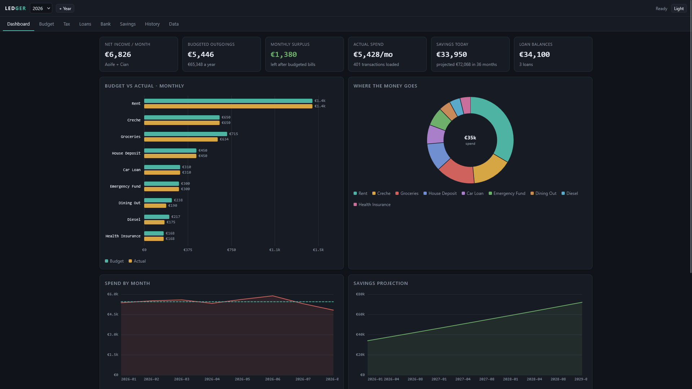
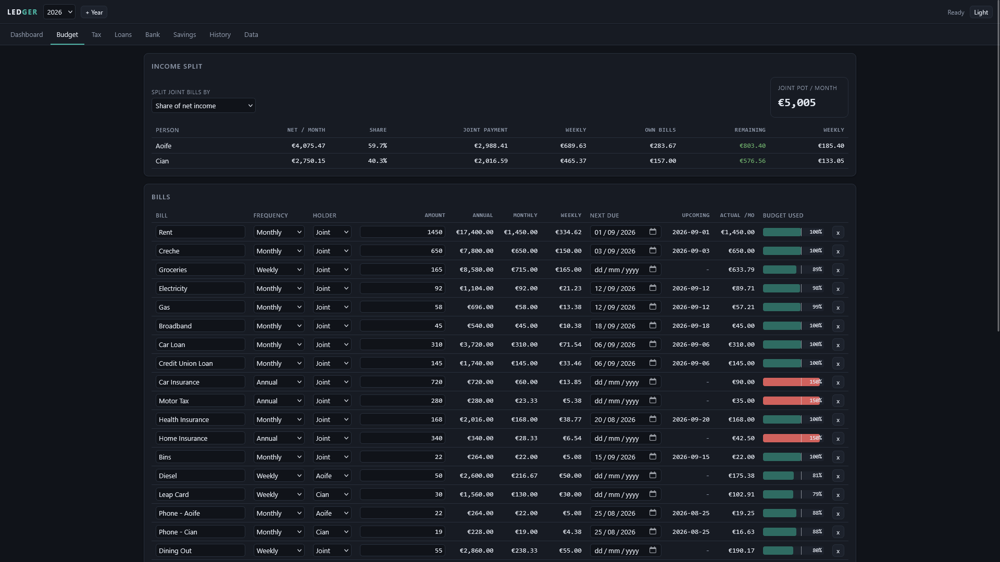
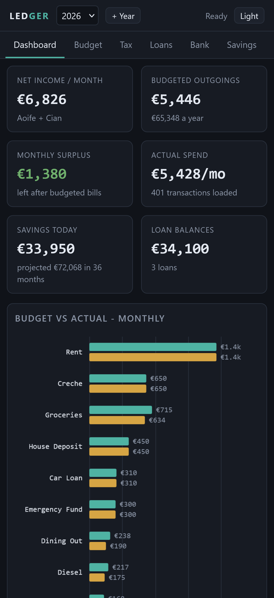
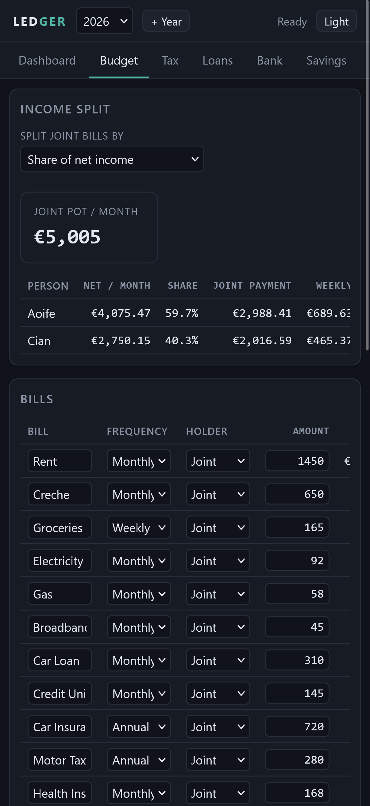
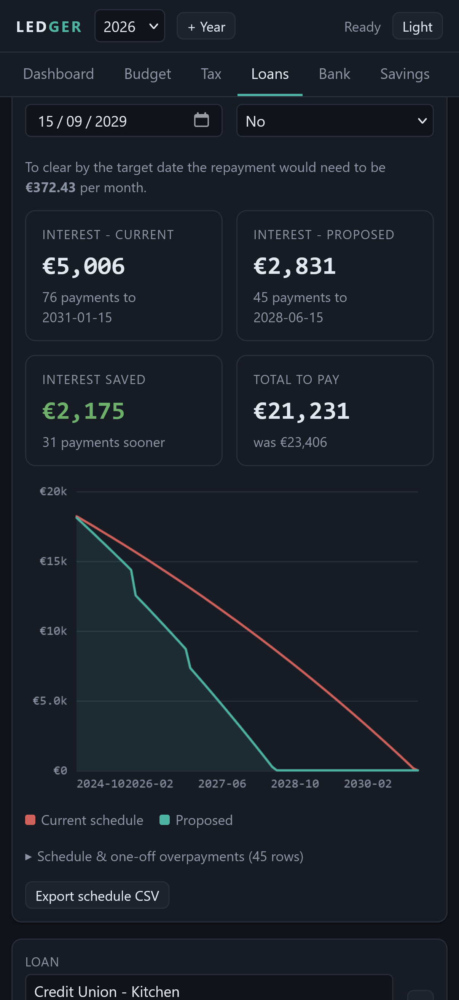

# Finance Ledger

A single-file personal finance workbook that runs entirely in your browser.

For years I ran my household finances out of one increasingly unhinged Excel workbook: bills, an Irish PAYE calculator I kept re-tuning every Budget, loan amortisation schedules, a bank statement categoriser, savings projections, a historical bill log. It worked well, but it only worked on a machine with Excel and wasn't any way mobile friendly. Also sharing it meant sharing everything in it.

So I rebuilt it as a web app. One HTML file, no build step, no dependencies, no server. Open it and it works, offline, on a phone or a laptop. Your data lives in that browser's local storage and nowhere else.

## What it does

**Budget** - bills at any frequency (weekly through annual), normalised to annual/monthly/weekly. Assign each bill to a person or to the joint pot, and the joint total gets split either pro-rata on net income or on percentages you set. Shows what each person has left after their share.

**Tax** - Irish PAYE, USC, PRSI and pension for as many earners as you need. Standard rate band, credits and USC bands are all editable, with the published figures for the year preloaded. Handles BIK, AVCs and a bonus taxed at the margin.

**Loans** - daily-interest amortisation, the same method my spreadsheet used. Model a higher repayment or drop lump sums onto individual payments and see the interest saved and how many payments earlier it clears.

**Bank** - import a CSV statement (AIB export format has been tested but anything with date/description/debit columns should work - headers are matched automatically). Rules map descriptions to categories, duplicates are skipped on re-import, and everything rolls up against the budget with weekly and monthly averages.

**Savings** - multiple accounts, monthly contributions, optional growth rate, projected out as far as you like.

**History** - a log of what bills actually cost month by month, kept across years, so next year's budget is set from real numbers instead of guesses.

| | |
|---|---|
|  |  |
| Budget and income split | Loan schedules and overpayments |

  
  
  

## Running it

Download `index.html` and open it. That is the whole install. Rename it if you want.

If you want it on a phone, drop it on any static host (or open it from cloud storage) and add it to your home screen. It never calls out to anything, so it works with no connection.

## Try it with demo data

`demo/ledger-demo-2026.json` is a fictional two-income household with 401 transactions, three loans, four savings accounts and two years of bill history. Nothing in it is real.

1. Open `index.html`
2. Data tab -> Restore from JSON -> pick the demo file

It loads as year 2026, so use a private window if you already have your own 2026 in there.

## Your data

Everything is held in `localStorage` under a single key. It is never transmitted, and there is no
analytics, no telemetry and no fonts or scripts loaded from anywhere.

That also means clearing site data wipes it, so take backups:

- **All years (JSON)** - full backup, restores everything
- **Single year (JSON)** - move one year between browsers or share a scenario
- **Workbook (.xlsx)** - one sheet per section, written natively without a library
- **CSV** - per section, if you want to pull something into a spreadsheet

"+ Year" rolls bills, loans, savings, rules and people into a new year, applies that year's tax figures and starts the transactions empty.

## Tax figures

Preloaded for 2024, 2025 and 2026 from the Budget and Revenue published rates. For 2026:

| | |
|---|---|
| Standard rate band | 44,000 single (up to 53,000 individual cap where bands are shared) |
| Rates | 20% / 40% |
| USC | 0.5% to 12,012, 2% to 28,700, 3% to 70,044, 8% above. Exempt under 13,000 |
| PRSI | 4.2%, rising to 4.35% from 1 October |
| Credits | 2,000 personal, 2,000 employee |

Every one of those is editable if your circumstances differ. To add a future year, create it and either edit the bands or add an entry to `TAX_PRESETS` in the source.

This is an estimate for planning, not a payslip and not tax advice. It does not model married band transfers automatically, week-1 basis, medical card USC rates, or anything self-employed. Check anything that matters against Revenue.

## Notes on the build

- One file, roughly 1,800 lines: HTML, CSS and JS, no framework, no CDN
- Charts are hand-drawn on canvas
- XLSX export is a minimal store-only ZIP plus inline-string sheet XML, so there is no library to
  keep current
- Light and dark themes, keyboard focus states, works down to a phone-width screen

## Licence

MIT - see [LICENSE](LICENSE).
